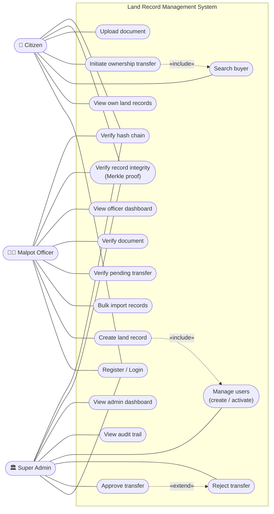

# Use Case Diagram

**Report section:** 3.1.1 Functional Requirements

Three actors — **Citizen**, **Malpot Officer**, **Super Admin (Nepal Sarkar)** —
in a single system-boundary diagram. Derived from the controller endpoints and
their role restrictions.

