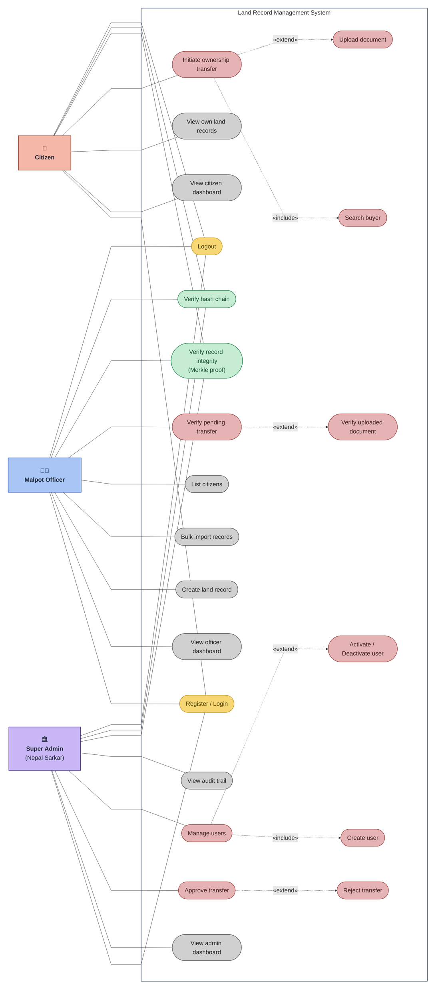

# Use Case Diagram

**Report section:** 3.1.1 Functional Requirements

Three actors — **Citizen**, **Malpot Officer**, **Super Admin (Nepal Sarkar)** —
in a single system-boundary diagram. Shared use cases (login, integrity
verification, hash-chain verification, logout) connect to all three actors.
Colour key: **rose** = use cases that carry an «include»/«extend» branch,
**gray** = plain views/actions, **green** = shared verification, **yellow** =
session/account. Derived from the controller endpoints and their role
restrictions.

> **Note on «include» / «extend» direction:** to match the common textbook
> layout the branch use cases are drawn to the *right* of their base
> (`base -.-> branch`). Strict UML draws the «extend» arrowhead on the base
> (extension → base); flip those lines if your supervisor requires it.

