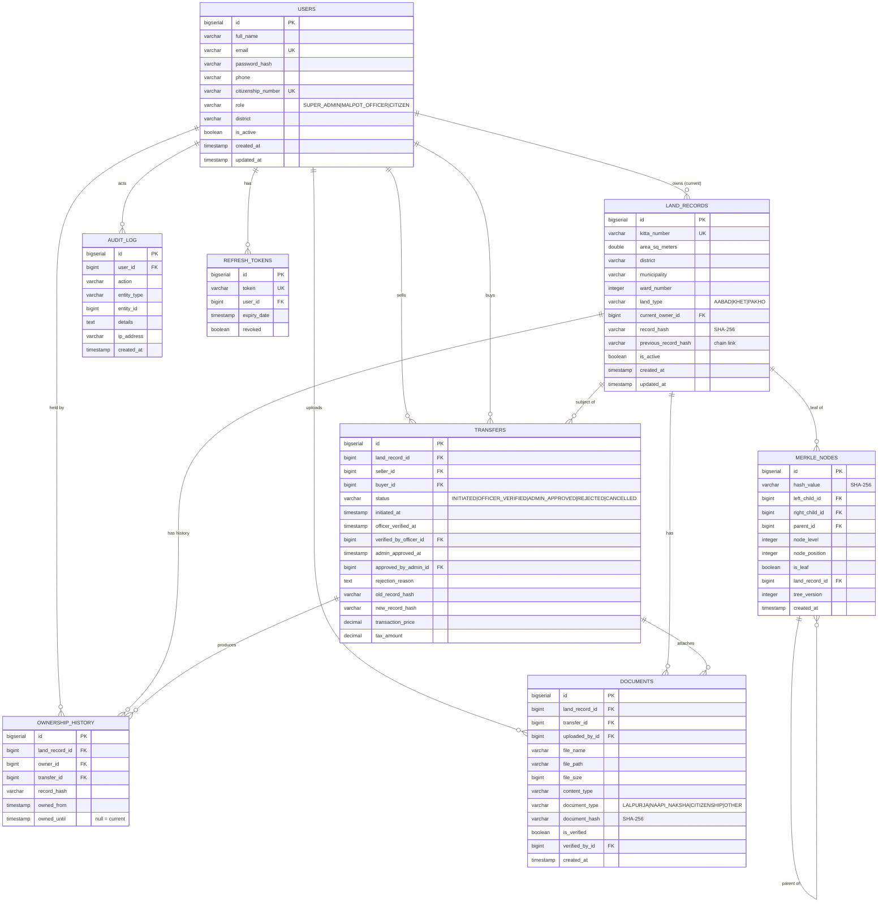

# Entity Relationship Diagram

**Report section:** 4.1 Database Design

Transcribed from the Flyway migrations (`V1`, `V4`–`V10`).

```mermaid
erDiagram
    USERS ||--o{ LAND_RECORDS : "owns (current)"
    USERS ||--o{ TRANSFERS : "sells"
    USERS ||--o{ TRANSFERS : "buys"
    USERS ||--o{ OWNERSHIP_HISTORY : "held by"
    USERS ||--o{ DOCUMENTS : "uploads"
    USERS ||--o{ AUDIT_LOG : "acts"
    USERS ||--o{ REFRESH_TOKENS : "has"
    LAND_RECORDS ||--o{ OWNERSHIP_HISTORY : "has history"
    LAND_RECORDS ||--o{ TRANSFERS : "subject of"
    LAND_RECORDS ||--o{ DOCUMENTS : "has"
    LAND_RECORDS ||--o{ MERKLE_NODES : "leaf of"
    TRANSFERS ||--o{ OWNERSHIP_HISTORY : "produces"
    TRANSFERS ||--o{ DOCUMENTS : "attaches"
    MERKLE_NODES ||--o{ MERKLE_NODES : "parent of"

    USERS {
        bigserial id PK
        varchar full_name
        varchar email UK
        varchar password_hash
        varchar phone
        varchar citizenship_number UK
        varchar role "SUPER_ADMIN|MALPOT_OFFICER|CITIZEN"
        varchar district
        boolean is_active
        timestamp created_at
        timestamp updated_at
    }
    LAND_RECORDS {
        bigserial id PK
        varchar kitta_number UK
        double area_sq_meters
        varchar district
        varchar municipality
        integer ward_number
        varchar land_type "AABAD|KHET|PAKHO"
        bigint current_owner_id FK
        varchar record_hash "SHA-256"
        varchar previous_record_hash "chain link"
        boolean is_active
        timestamp created_at
        timestamp updated_at
    }
    OWNERSHIP_HISTORY {
        bigserial id PK
        bigint land_record_id FK
        bigint owner_id FK
        bigint transfer_id FK
        varchar record_hash
        timestamp owned_from
        timestamp owned_until "null = current"
    }
    TRANSFERS {
        bigserial id PK
        bigint land_record_id FK
        bigint seller_id FK
        bigint buyer_id FK
        varchar status "INITIATED|OFFICER_VERIFIED|ADMIN_APPROVED|REJECTED|CANCELLED"
        timestamp initiated_at
        timestamp officer_verified_at
        bigint verified_by_officer_id FK
        timestamp admin_approved_at
        bigint approved_by_admin_id FK
        text rejection_reason
        varchar old_record_hash
        varchar new_record_hash
        decimal transaction_price
        decimal tax_amount
    }
    DOCUMENTS {
        bigserial id PK
        bigint land_record_id FK
        bigint transfer_id FK
        bigint uploaded_by_id FK
        varchar file_name
        varchar file_path
        bigint file_size
        varchar content_type
        varchar document_type "LALPURJA|NAAPI_NAKSHA|CITIZENSHIP|OTHER"
        varchar document_hash "SHA-256"
        boolean is_verified
        bigint verified_by_id FK
        timestamp created_at
    }
    AUDIT_LOG {
        bigserial id PK
        bigint user_id FK
        varchar action
        varchar entity_type
        bigint entity_id
        text details
        varchar ip_address
        timestamp created_at
    }
    REFRESH_TOKENS {
        bigserial id PK
        varchar token UK
        bigint user_id FK
        timestamp expiry_date
        boolean revoked
    }
    MERKLE_NODES {
        bigserial id PK
        varchar hash_value "SHA-256"
        bigint left_child_id FK
        bigint right_child_id FK
        bigint parent_id FK
        integer node_level
        integer node_position
        boolean is_leaf
        bigint land_record_id FK
        integer tree_version
        timestamp created_at
    }
```
