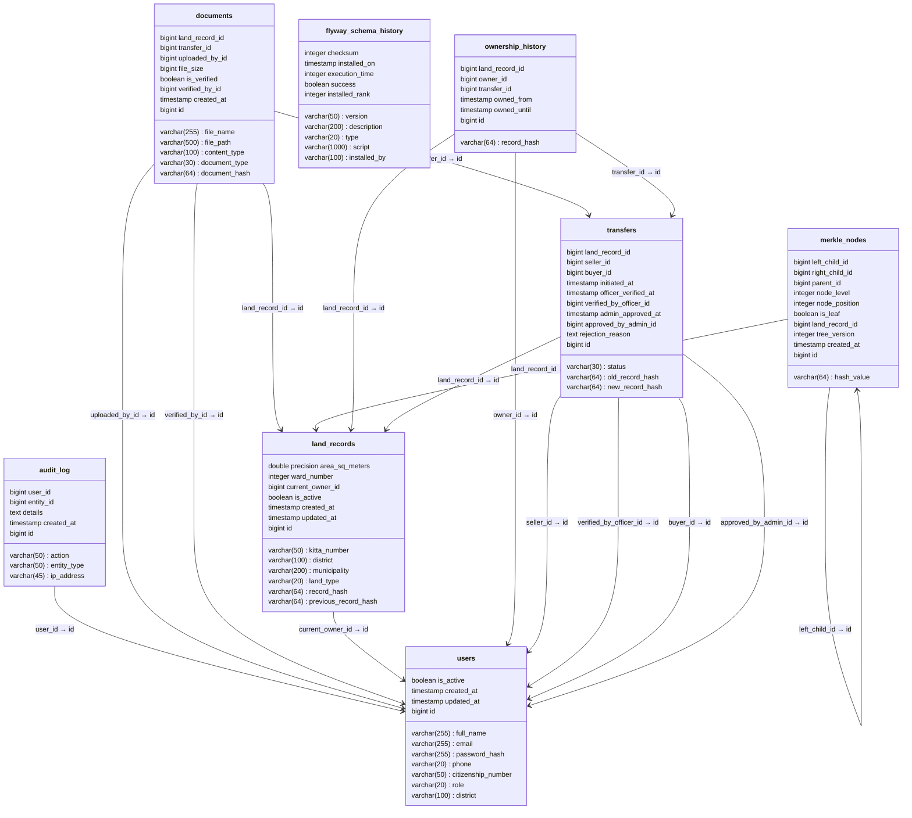

# Entity Relationship / Database Schema Diagram

**Report section:** 4.1 Database Design

Full physical schema reverse-engineered from the PostgreSQL database
(`flyway_schema_history` is Flyway's migration bookkeeping table). Arrows are
foreign-key references (`column : referenced_column`). Rendered with the light
theme on a white background.

