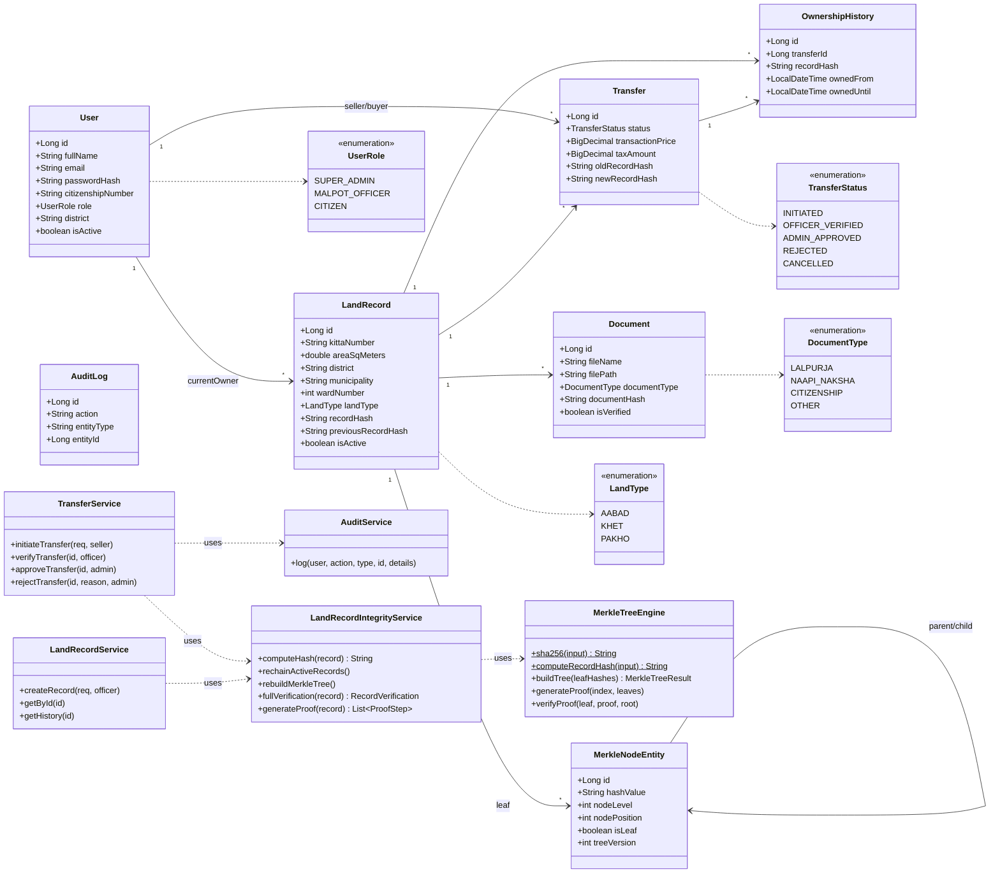

# Class Diagram

**Report section:** 3.1.3 / 4.1 Object modelling

Domain model + service layer (the classes that carry the business logic). DTOs,
repositories, and controllers are summarised rather than enumerated.

