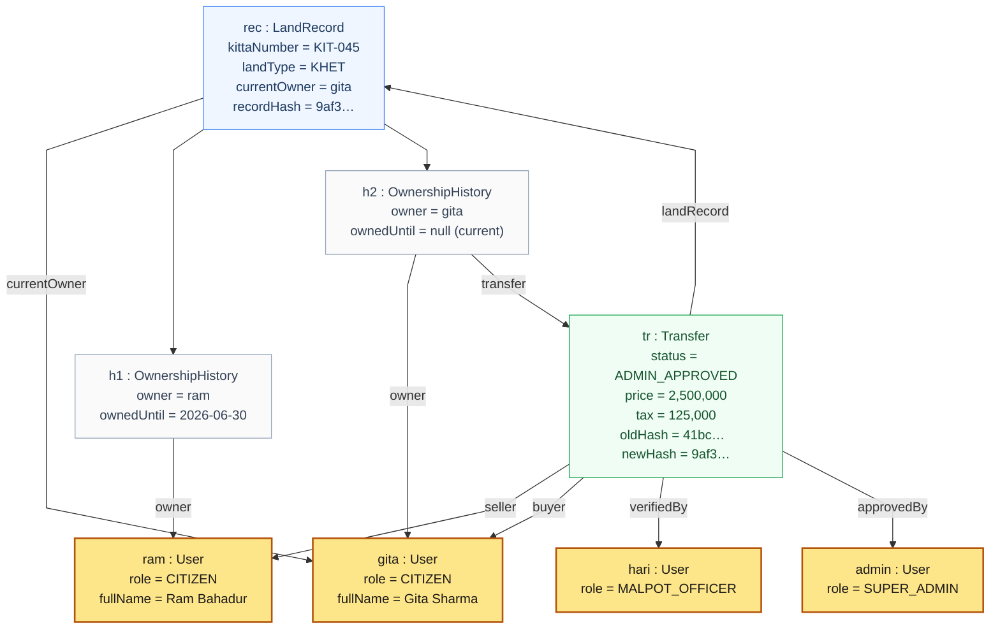

# Object Diagram

**Report section:** 3.1.3 Object modelling

A concrete snapshot: kitta *KIT-045* transferred from Ram to Gita, officer-verified
and admin-approved (mirrors the demo flow in the README).

