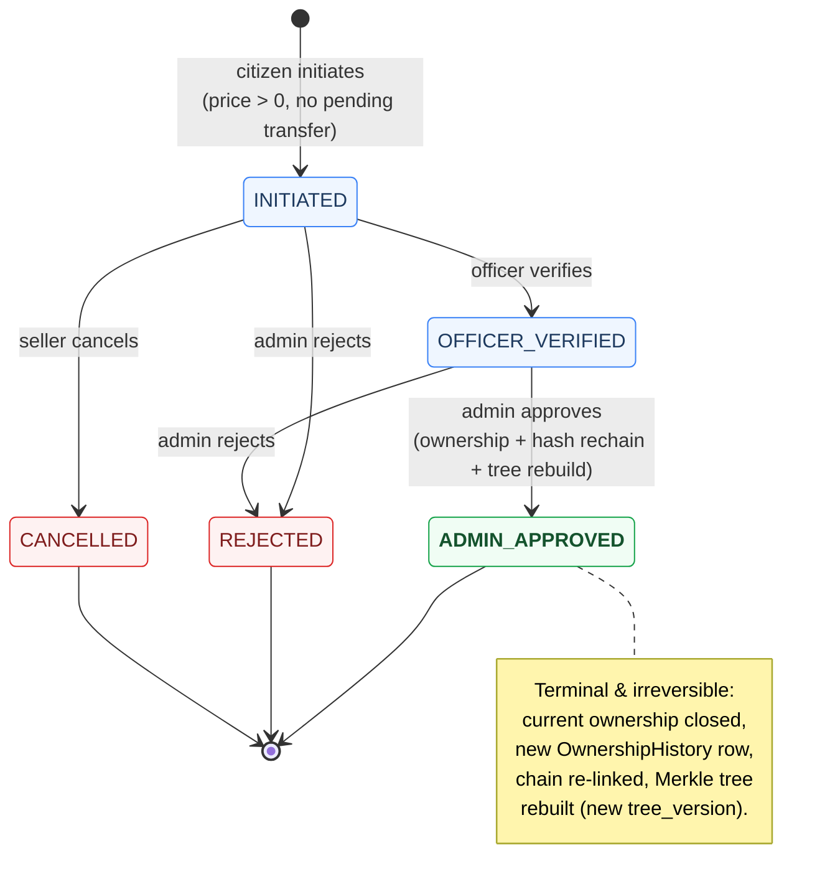

# State Diagram — Ownership Transfer

**Report section:** 3.1.3 Dynamic modelling

Lifecycle of the `Transfer.status` field (`TransferStatus` enum), driven by
`TransferService`.

> **Note:** `CANCELLED` exists in the `TransferStatus` enum but no controller
> endpoint currently sets it. The `INITIATED → CANCELLED` edge is shown as
> designed behaviour; drop it if you only want to depict implemented transitions.
