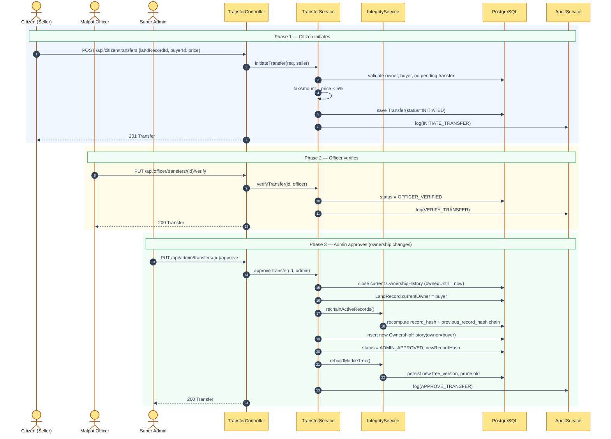

# Sequence Diagram — Ownership Transfer

**Report section:** 3.1.3 Dynamic modelling

End-to-end, matching `TransferService.initiate → verify → approve`.

```mermaid
%%{init: {'theme': 'base', 'themeVariables': {
    'actorBkg': '#fde68a', 'actorBorder': '#b45309', 'actorTextColor': '#1c1917',
    'signalColor': '#334155', 'signalTextColor': '#334155',
    'labelBoxBkgColor': '#eff6ff', 'labelBoxBorderColor': '#3b82f6',
    'noteBkgColor': '#f0fdf4', 'noteBorderColor': '#16a34a',
    'sequenceNumberColor': '#ffffff'
}}}%%
sequenceDiagram
    autonumber
    actor C as Citizen (Seller)
    actor O as Malpot Officer
    actor A as Super Admin
    participant API as TransferController
    participant TS as TransferService
    participant IS as IntegrityService
    participant DB as PostgreSQL
    participant AU as AuditService

    rect rgb(239, 246, 255)
        note over C,AU: Phase 1 — Citizen initiates
        C->>API: POST /api/citizen/transfers {landRecordId, buyerId, price}
        API->>TS: initiateTransfer(req, seller)
        TS->>DB: validate owner, buyer, no pending transfer
        TS->>TS: taxAmount = price × 5%
        TS->>DB: save Transfer(status=INITIATED)
        TS->>AU: log(INITIATE_TRANSFER)
        API-->>C: 201 Transfer
    end

    rect rgb(254, 252, 232)
        note over O,AU: Phase 2 — Officer verifies
        O->>API: PUT /api/officer/transfers/{id}/verify
        API->>TS: verifyTransfer(id, officer)
        TS->>DB: status = OFFICER_VERIFIED
        TS->>AU: log(VERIFY_TRANSFER)
        API-->>O: 200 Transfer
    end

    rect rgb(240, 253, 244)
        note over A,AU: Phase 3 — Admin approves (ownership changes)
        A->>API: PUT /api/admin/transfers/{id}/approve
        API->>TS: approveTransfer(id, admin)
        TS->>DB: close current OwnershipHistory (ownedUntil = now)
        TS->>DB: LandRecord.currentOwner = buyer
        TS->>IS: rechainActiveRecords()
        IS->>DB: recompute record_hash + previous_record_hash chain
        TS->>DB: insert new OwnershipHistory(owner=buyer)
        TS->>DB: status = ADMIN_APPROVED, newRecordHash
        TS->>IS: rebuildMerkleTree()
        IS->>DB: persist new tree_version, prune old
        TS->>AU: log(APPROVE_TRANSFER)
        API-->>A: 200 Transfer
    end
```
