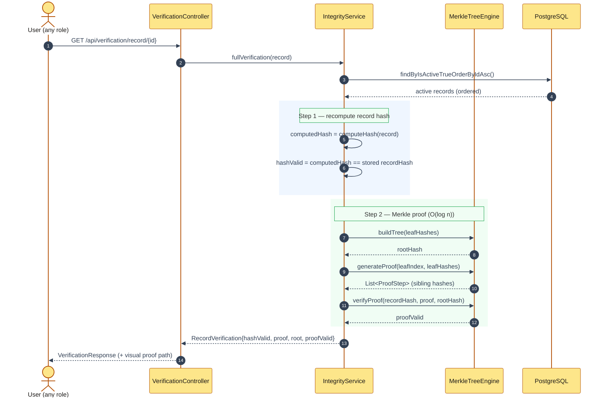

# Sequence Diagram — Record Integrity Verification

**Report section:** 3.1.3 Dynamic modelling

Matches `VerificationController → LandRecordIntegrityService.fullVerification`
(single active-record load + one Merkle build).

