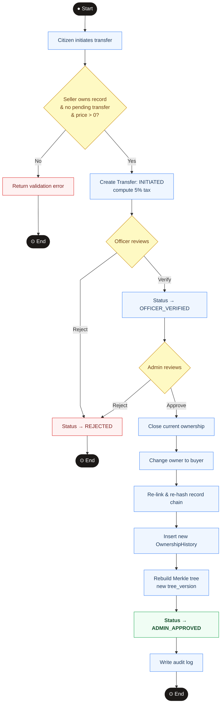

# Activity Diagram — End-to-End Transfer

**Report section:** 3.1.3 Process modelling

```mermaid
%%{init: {'flowchart': {'curve': 'linear'}}}%%
flowchart TD
    start([● Start]) --> init[Citizen initiates transfer]
    init --> owns{Seller owns record<br/>& no pending transfer<br/>& price > 0?}
    owns -- No --> err[Return validation error] --> stop1([⊙ End])
    owns -- Yes --> save[Create Transfer: INITIATED<br/>compute 5% tax]
    save --> officer{Officer reviews}
    officer -- Verify --> ver[Status → OFFICER_VERIFIED]
    officer -- Reject --> rej[Status → REJECTED] --> stop2([⊙ End])
    ver --> admin{Admin reviews}
    admin -- Reject --> rej
    admin -- Approve --> close[Close current ownership]
    close --> chown[Change owner to buyer]
    chown --> rechain[Re-link & re-hash record chain]
    rechain --> newhist[Insert new OwnershipHistory]
    newhist --> rebuild[Rebuild Merkle tree<br/>new tree_version]
    rebuild --> done[Status → ADMIN_APPROVED] --> log[Write audit log] --> stop3([⊙ End])

    classDef terminal fill:#1c1917,stroke:#1c1917,color:#ffffff
    classDef decision fill:#fef9c3,stroke:#ca8a04,color:#713f12
    classDef process fill:#eff6ff,stroke:#3b82f6,color:#1e3a5f
    classDef success fill:#f0fdf4,stroke:#16a34a,color:#14532d,font-weight:bold
    classDef failure fill:#fef2f2,stroke:#dc2626,color:#7f1d1d

    class start,stop1,stop2,stop3 terminal
    class owns,officer,admin decision
    class init,save,ver,close,chown,rechain,newhist,rebuild,log process
    class done success
    class err,rej failure
```
