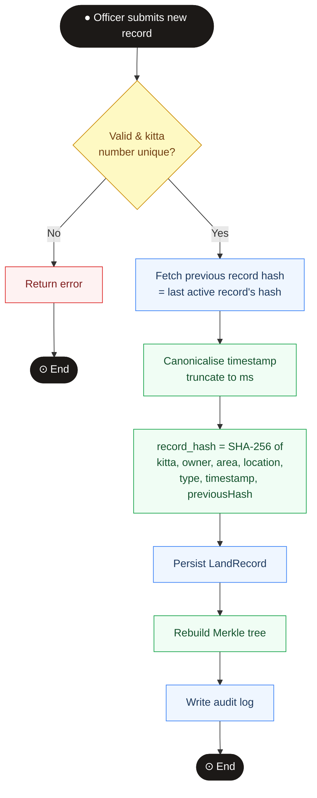

# Activity Diagram — Create Land Record & Hashing

**Report section:** 3.1.3 Process modelling

```mermaid
%%{init: {'flowchart': {'curve': 'linear'}}}%%
flowchart TD
    start([● Officer submits new record]) --> validate{Valid & kitta<br/>number unique?}
    validate -- No --> err[Return error] --> stop1([⊙ End])
    validate -- Yes --> prev[Fetch previous record hash<br/>= last active record's hash]
    prev --> canon[Canonicalise timestamp<br/>truncate to ms]
    canon --> hash[record_hash = SHA-256 of<br/>kitta, owner, area, location,<br/>type, timestamp, previousHash]
    hash --> persist[Persist LandRecord]
    persist --> tree[Rebuild Merkle tree]
    tree --> audit[Write audit log]
    audit --> stop([⊙ End])

    classDef terminal fill:#1c1917,stroke:#1c1917,color:#ffffff
    classDef decision fill:#fef9c3,stroke:#ca8a04,color:#713f12
    classDef process fill:#eff6ff,stroke:#3b82f6,color:#1e3a5f
    classDef crypto fill:#f0fdf4,stroke:#16a34a,color:#14532d
    classDef failure fill:#fef2f2,stroke:#dc2626,color:#7f1d1d

    class start,stop,stop1 terminal
    class validate decision
    class prev,persist,audit process
    class canon,hash,tree crypto
    class err failure
```
