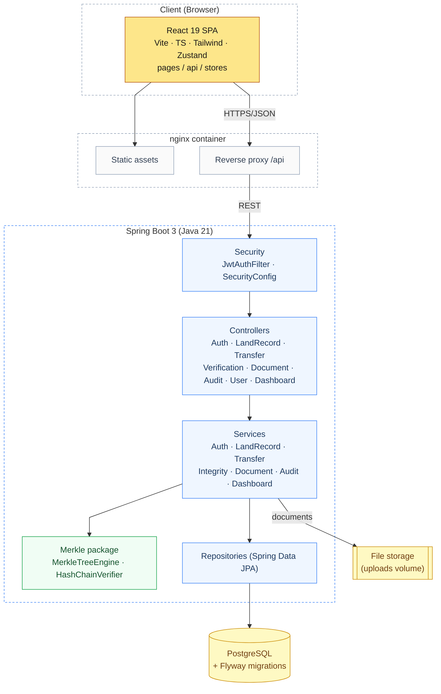

# Component Diagram

**Report section:** 4.1 Component Diagram

```mermaid
%%{init: {'flowchart': {'curve': 'linear'}}}%%
flowchart TB
    subgraph Browser["Client (Browser)"]
        RF["React 19 SPA<br/>Vite · TS · Tailwind · Zustand<br/>pages / api / stores"]
    end

    subgraph Nginx["nginx container"]
        static["Static assets"]
        proxy["Reverse proxy /api"]
    end

    subgraph Backend["Spring Boot 3 (Java 21)"]
        sec["Security<br/>JwtAuthFilter · SecurityConfig"]
        ctrl["Controllers<br/>Auth · LandRecord · Transfer<br/>Verification · Document · Audit · User · Dashboard"]
        svc["Services<br/>Auth · LandRecord · Transfer<br/>Integrity · Document · Audit · Dashboard"]
        merkle["Merkle package<br/>MerkleTreeEngine · HashChainVerifier"]
        repo["Repositories (Spring Data JPA)"]
    end

    db[("PostgreSQL<br/>+ Flyway migrations")]
    fs[["File storage<br/>(uploads volume)"]]

    RF -->|HTTPS/JSON| proxy
    RF --> static
    proxy -->|REST| sec
    sec --> ctrl
    ctrl --> svc
    svc --> merkle
    svc --> repo
    repo --> db
    svc -->|documents| fs

    classDef client fill:#fde68a,stroke:#b45309,color:#1c1917
    classDef web fill:#fafafa,stroke:#94a3b8,color:#334155
    classDef app fill:#eff6ff,stroke:#3b82f6,color:#1e3a5f
    classDef crypto fill:#f0fdf4,stroke:#16a34a,color:#14532d
    classDef store fill:#fef9c3,stroke:#ca8a04,color:#713f12

    class RF client
    class static,proxy web
    class sec,ctrl,svc,repo app
    class merkle crypto
    class db,fs store
    style Browser fill:#ffffff,stroke:#94a3b8,stroke-dasharray:4 3
    style Nginx fill:#ffffff,stroke:#94a3b8,stroke-dasharray:4 3
    style Backend fill:#ffffff,stroke:#3b82f6,stroke-dasharray:4 3
```
