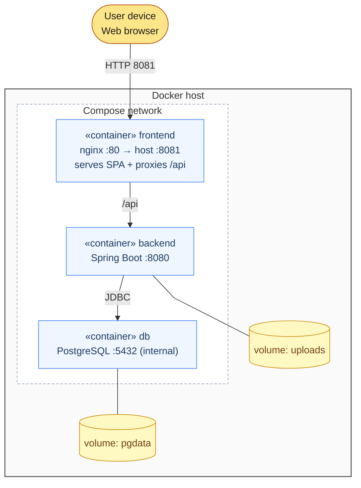

# Deployment Diagram

**Report section:** 4.1 Deployment Diagram

Reflects `docker-compose.yml` (nginx-fronted frontend, backend, db, storage volumes).

```mermaid
%%{init: {'flowchart': {'curve': 'linear'}}}%%
flowchart TB
    user(["User device<br/>Web browser"])

    subgraph Host["Docker host"]
        subgraph net["Compose network"]
            fe["«container» frontend<br/>nginx :80 → host :8081<br/>serves SPA + proxies /api"]
            be["«container» backend<br/>Spring Boot :8080"]
            pg["«container» db<br/>PostgreSQL :5432 (internal)"]
        end
        vol1[("volume: pgdata")]
        vol2[("volume: uploads")]
    end

    user -->|HTTP 8081| fe
    fe -->|/api| be
    be -->|JDBC| pg
    pg --- vol1
    be --- vol2

    classDef device fill:#fde68a,stroke:#b45309,color:#1c1917
    classDef container fill:#eff6ff,stroke:#3b82f6,color:#1e3a5f
    classDef volume fill:#fef9c3,stroke:#ca8a04,color:#713f12

    class user device
    class fe,be,pg container
    class vol1,vol2 volume
    style Host fill:#fafafa,stroke:#525252,stroke-width:1.5px
    style net fill:#ffffff,stroke:#94a3b8,stroke-dasharray:4 3
```
