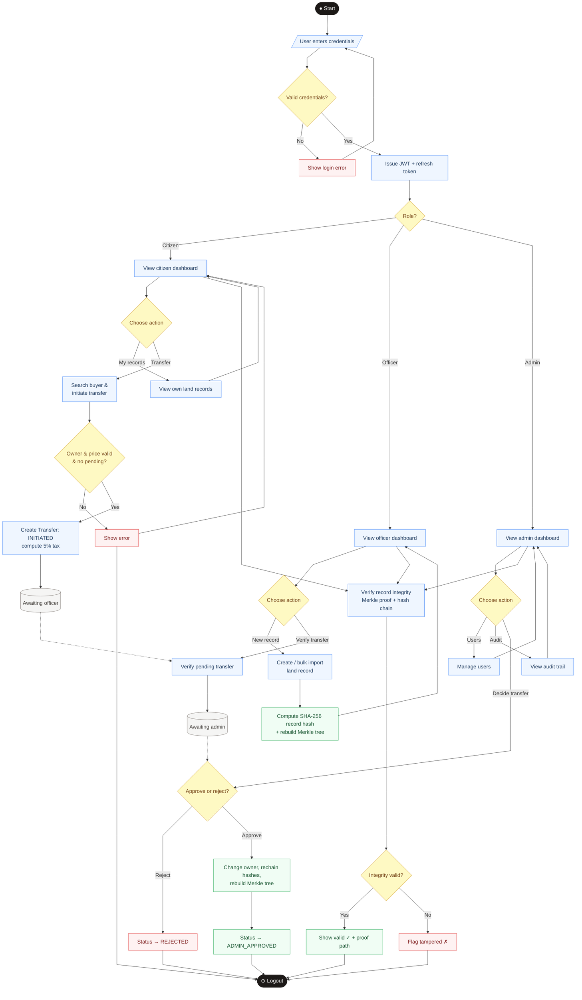

# System Flowchart

**Report section:** supplementary (overall program flow)

Top-level flow of the application: authentication, role-based routing, and the
main operations for each role, including the transfer lifecycle and integrity
verification. Colour key: **black** terminals, **yellow** decisions, **blue**
process steps, **green** cryptographic/integrity steps, **red** failure paths.

