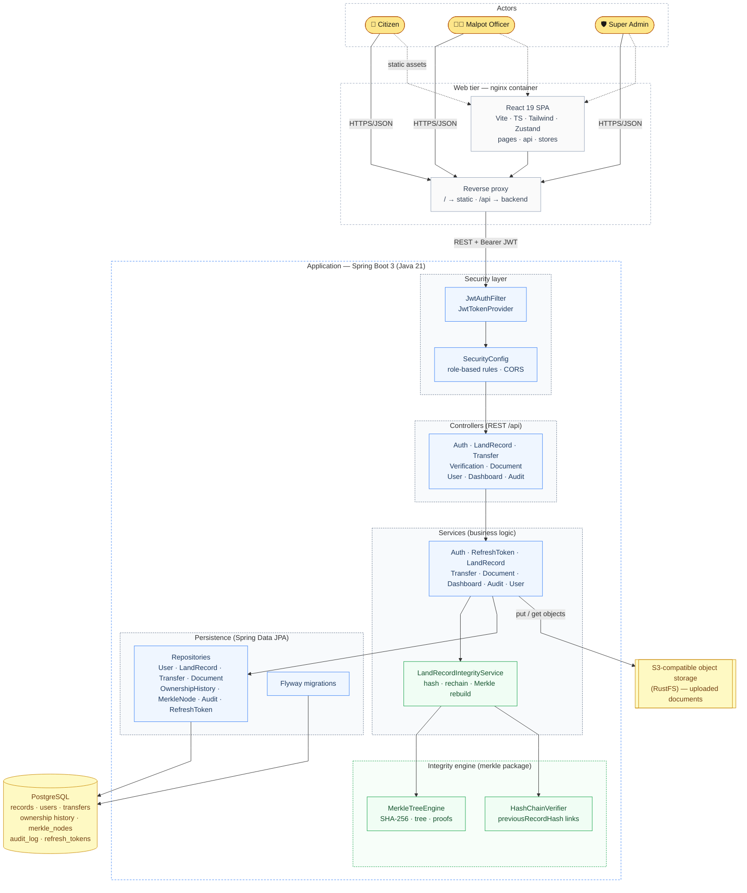

# System Architecture Diagram

**Report section:** 4.1 System Architecture

A holistic view of the whole system: the three actor roles, the nginx-served
React SPA, the layered Spring Boot backend (security → controllers → services →
repositories), the cryptographic integrity subsystem, and the two backing
stores (PostgreSQL and S3-compatible object storage). Colour key: **yellow**
actors, **grey** web tier, **blue** application layers, **green**
cryptographic/integrity components, **amber** data stores.

